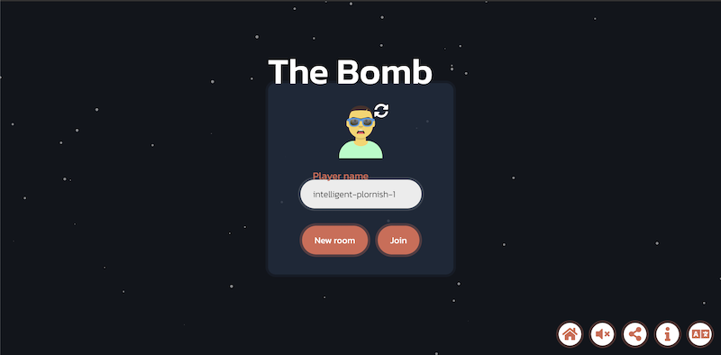
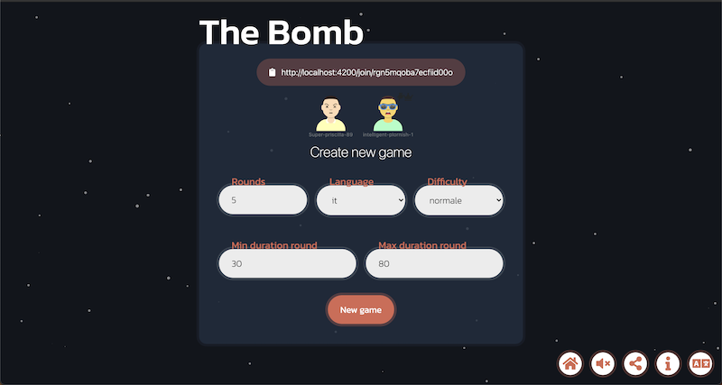
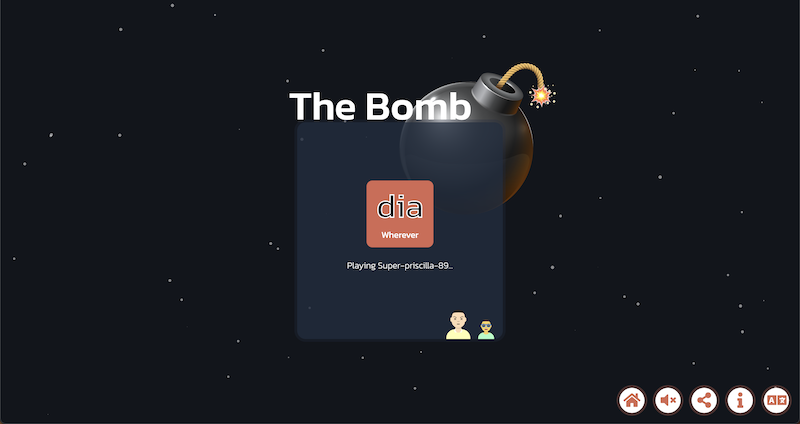
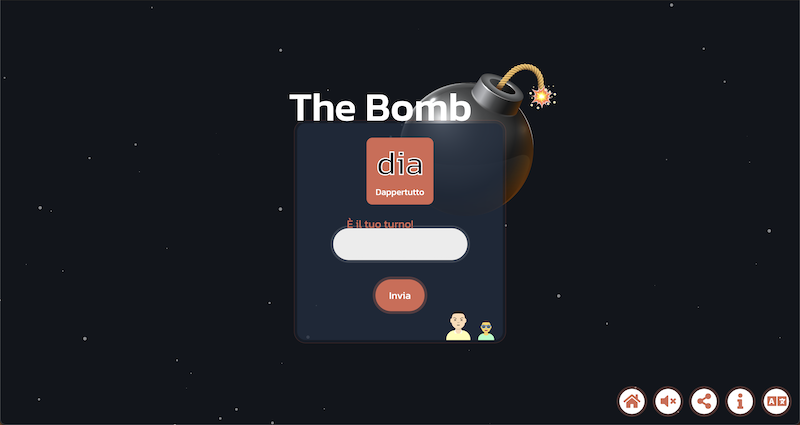
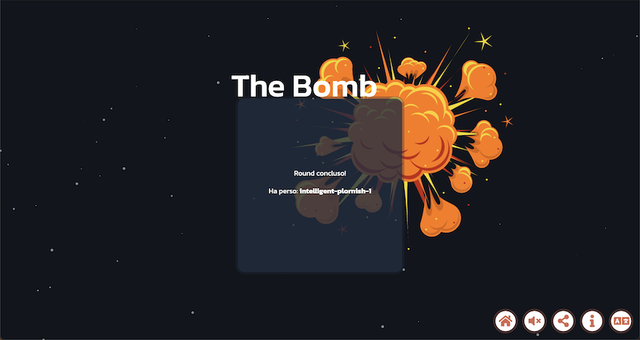
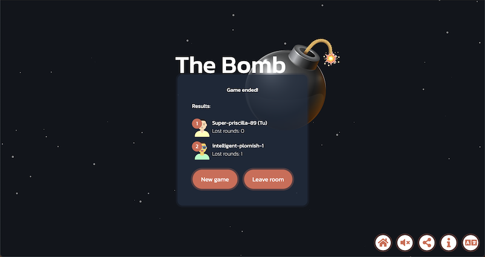

# 💣 The BOMB

- [💣 The BOMB](#-the-bomb)
  - [😆 How this project started?](#-how-this-project-started)
  - [⚙ The logic](#-the-logic)
  - [💻 Nerd details](#-nerd-details)
    - [🩲 Backend structure](#-backend-structure)
    - [👔 Frontend](#-frontend)
    - [🏃🏻‍♀️ How to run](#️-how-to-run)
      - [Preconditions](#preconditions)
      - [Backend](#backend)
      - [Frontend](#frontend)
    - [Screenshots 📸](#screenshots-)

This word game is inspired to the classical board game "Passa la bomba" that in italian means "hand the bomb". 

#### Architecture overview video (language: italian)

https://www.youtube.com/watch?v=fim4Mubrrng&t=1523s

## 😆 How this project started?

But of course, during 2020 quarantine: I was used to meet with my friends and family though long video calls playing board or online games to spend some time "together". Since there was no online version of this game my idea was to bring this simple concept online (I assure that is better than trying to playing sharing Paint on the desktop!).

## ⚙ The logic

I think this is a old game logic. On each round you get a syllable, each player, in turn, has to guess a word that contains (somehow) that syllable. But be careful you do not have plenty of time: if you guess a word you will "hand the bomb" to the next player, instead if the bomb explodes when you're trying to put a word you will lose! On each round the system will decide the syllable, when to make the bomb explode but also how to compose the guessing words: do not put the syllable at the beginning of the word, or not at the end or put wherever you want. You cannot reuse a word in the same round, you have to choose existing and reasonable words.

## 💻 Nerd details

The microservices backend of the application is made using [Moleculer.services](https://moleculer.services/) while the frontend is made using AngularJS (just kidding, it's [version 9](https://angular.io)). Real time communication is garanteed by [SocketIO](https://socket.io/).

### 🩲 Backend structure

The backend relies on a Postgres database instance a Redis instance and 5 nodes:
- `gateway`: exposes the API for the game
- `bridge`: ensure the real time communication with socketio
- `rooms`: handles the rooms creation and joining
- `game`: holds the game logic and keeps track of the rounds
- `words`: handles the services that memorize the words for each language

The python folder holds a small project for generating syllables from words dictionary and weights them based on how much they recurs. Collaborations are welcome here!

### 👔 Frontend
The frontend is made in Angular 9 and [RXJS](https://rxjs-dev.firebaseapp.com/).

### 🏃🏻‍♀️ How to run

Soon I'll file a docker-compose or something like that...

#### Preconditions

- Ensure to have [nodejs](https://nodejs.org/it/) >= 12.
- Ensure to have a Postgres database running in local (you can try it with [the Docker image](https://hub.docker.com/_/postgres))
- Ensure to have a proper Redis server running ([here](https://hub.docker.com/_/redis) for docker)
- Tweak the `config.dev.js` for the local configuration
- Run `npm i` on each folder.

#### Backend

You can run the backend by running: `npm run dev` on each node folder.

#### Frontend

Simply use the [Angular CLI](https://cli.angular.io/): `ng serve -o`.

### Screenshots 📸

